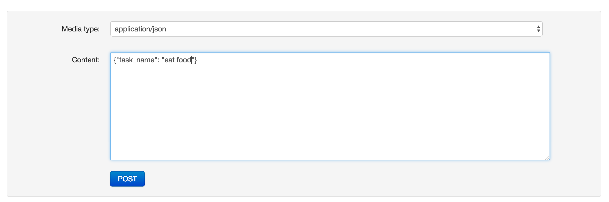
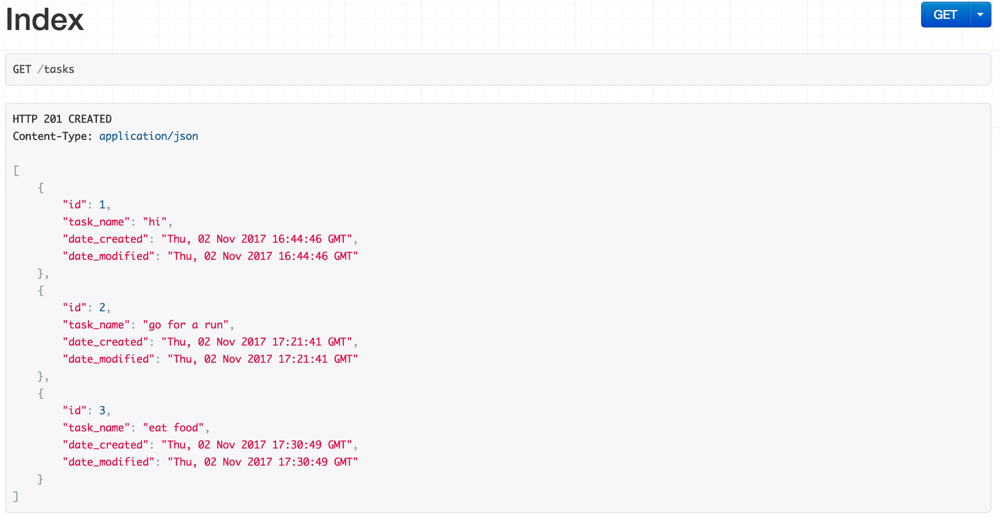
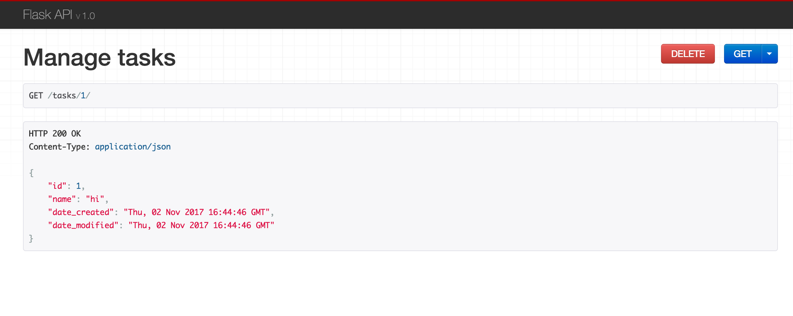
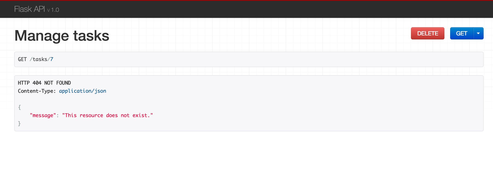

# Handling Exceptions in Flask

This tutorial will teach you how to handle exceptions in Flask. We will build a simple RESTful Flask API and create custom exceptions for our code.

Dependencies:

- Python v3.6.3
- Flask v0.12.2
- Flask-SQLAlchemy v2.3.2
- Flask API v1.0

## Objectives

By the end of this tutorial, you will be able to:

1. Define Python exceptions
1. Understand the Flask API framework
1. Create custom exceptions for your code
1. Use Python exceptions in Flask

## What is a Python Exception?

A python exception is an error that occurs when executing a program, causing the program to stop. If you think that your program might raise an exception when executed, you might find it useful to use exceptions to handle the errors.

## Example

In the example below, we prompt the user to enter a number. The program will *only* work if you enter a number as input.

```python
while True:
  y = int(input('Please enter a number: '))
  print(f'{y} squared is {y**2}')
```

Let's see what happens when the user input a string:

```sh
Please enter a number: four
Traceback (most recent call last):
  File "<stdin>", line 2, in <module>
ValueError: invalid literal for int() with base 10: 'four'
```

When you enter a string, or any other character that is not an integer, the program will throw a `ValueError` exception.

To handle the error, we can add a `try/except`:

```python
while True:
  try:
    y = int(input('Please enter a number: '))
    print(f'{y} squared is {y**2}')
  except ValueError:
      print('Enter numbers only')
```

Now, the code inside the `try` statement is executed first. If the user enters an integer, the `except` statement is skipped. On the other hand, if the user enters a string, the code within the `except` statement is executed.

## Flask API Example

To speed up development, we'll use [Flask API](http://www.flaskapi.org/), which is an implementation of the same web browsable API that [Django REST framework](http://www.django-rest-framework.org/) provides. It'll help us implement our own browsable API.

We will develop an API for Tasks, where users will be able to:

- Create new tasks
- View all tasks
- Delete existing tasks

## Project Setup

Create a new project called "task-exceptions":

```sh
$ mkdir task-exceptions && cd task-exceptions
$ python3.6 -m venv env
$ source env/bin/activate
(env)$
```

Install the necessary dependencies:

```sh
(env)$ pip install flask==0.12.2
(env)$ pip install flask-sqlalchemy==2.3.2
(env)$ pip install flask-api==1.0
(env)$ pip freeze > requirements.txt
```

Create the following files and folders:

```sh
├── app
│   ├── __init__.py
│   ├── errors.py
│   └── models.py
├── requirements.txt
└── run.py
```

Be sure to add a *.gitignore* to the project root if you're using git:

```
__pycache__
env
```

### Database Configurations

Along with SQLite, we'll use [Flask-SQLAlchemy](http://flask-sqlalchemy.pocoo.org) to manage  [SQLAlchemy](https://www.sqlalchemy.org/). Define the following database configurations in *app/\_\_init\_\_.py*:

```python
from flask_sqlalchemy import SQLAlchemy
from flask_api import FlaskAPI


app = FlaskAPI(__name__)
app.config['SQLALCHEMY_DATABASE_URI'] = 'sqlite:///tasks.db'
app.config['SQLALCHEMY_TRACK_MODIFICATIONS'] = False
db = SQLAlchemy(app)
```

### Database Model

Add the task model to the *models.py* file:

```python
import datetime

from sqlalchemy import String, Integer, DateTime

from app import db


class Task(db.Model):
    id = db.Column(db.Integer, primary_key=True)
    task_name = db.Column(db.String(80), unique=True)
    date_created = db.Column(db.DateTime, default=datetime.datetime.utcnow)
    date_modified = db.Column(db.DateTime, default=datetime.datetime.utcnow)

    def __init__(self, task_name):
        self.task_name = task_name

    def __repr__(self):
        return f'<Task {self.task_name}>'

    def to_json(self):
        return {
            'id': self.id,
            'task_name': self.task_name,
            'date_created': self.date_created,
            'date_modified': self.date_modified
        }
```

### Run

Now, let's define an entry point to start our app. Inside *run.py*, add the following code:

```python
from flask import jsonify, request
from flask_api import status, exceptions

from app import app, db
from app.models import Task


if __name__ == '__main__':
    db.create_all()
    app.run(debug=True)
```

What's happening?

1. `db.create.all()` creates the database tables when we run the app
1. `debug = true ` enables Flask [debug mode](http://flask.pocoo.org/docs/0.12/quickstart/#debug-mode), which is important for debugging while you're developing your app app. Do not use this in production.

### Sanity Check

Back in the terminal, run:

```sh
(env)$ python run.py
```

You should see something similar to:

```sh
* Running on http://127.0.0.1:5000/ (Press CTRL+C to quit)
* Restarting with stat
* Debugger is active!
* Debugger PIN: 295-423-238
```

Also, the database - *tasks.db* - should have been created in the "app" directory. To view, first kill the Flask server, and then run:

```sh
(env)$ sqlite3 app/tasks.db

sqlite> .schema
CREATE TABLE task (
	id INTEGER NOT NULL,
	task_name VARCHAR(80),
	date_created DATETIME,
	date_modified DATETIME,
	PRIMARY KEY (id),
	UNIQUE (task_name)
);
sqlite>
```

Now that we are done with the basic setup, the next step is to create our views, which we'll separate into two views:

1. all tasks
1. single task

## View - all tasks

As mentioned in the beginning of the tutorial, we want to be able to add, delete, and show all our tasks. Let's define our first view and see how to handle basic exceptions.

In the *run.py*, add the following view:

```python
@app.route('/tasks', methods=['GET', 'POST'])
def index():
    if request.method == 'GET':
        tasks = Task.query.all()
        results = [t.to_json() for t in tasks]
        return results, status.HTTP_201_CREATED
    elif request.method == 'POST':
        task_name = request.data['task_name']
        if task_name:
            new_task = Task(task_name=task_name)
            db.session.add(new_task)
            db.session.commit()
            response = new_task.to_json()
            return response, status.HTTP_201_CREATED
```


Add the following imports as well:

1. `from flask import request`
1. `from flask_api import FlaskAPI, status`
1. `from app.models import Task`

You should now have:

```python
from flask import request
from flask_sqlalchemy import SQLAlchemy
from flask_api import FlaskAPI, status


app = FlaskAPI(__name__)
app.config['SQLALCHEMY_DATABASE_URI'] = 'sqlite:///tasks.db'
app.config['SQLALCHEMY_TRACK_MODIFICATIONS'] = False
db = SQLAlchemy(app)

from app.models import Task

@app.route('/tasks', methods=['GET', 'POST'])
def index():
    if request.method == 'GET':
        tasks = Task.query.all()
        results = [t.to_json() for t in tasks]
        return results, status.HTTP_201_CREATED
    elif request.method == 'POST':
        task_name = request.data['task_name']
        if task_name:
            new_task = Task(task_name=task_name)
            db.session.add(new_task)
            db.session.commit()
            response = new_task.to_json()
            return response, status.HTTP_201_CREATED
```

Now, run the app:

```sh
(env)$ python run.py
```

Navigate to [http://localhost:5000/tasks](http://localhost:5000/tasks) in your browser of choice. You should see an empty list of tasks because we have not added any yet:


<br>

Add several tasks via the `POST` request form:



<br>

Refresh the page, and you should see a list of all the tasks:



<br>

Alternatively, you can use cURL to view all tasks:

```sh
$ curl http://127.0.0.1:5000/tasks
```

And to add a task:

```sh
$ curl -H "Content-type: application/json" \
  -X POST http://127.0.0.1:5000/tasks \
  -d '{"task_name":"go shopping"}'
```

Now, try to do a `POST` request with no data. You should see a `Bad Request` error, which you do not want your end users to see and is exactly why want to handle exceptions in your code.

## Handling Exceptions

It's worth noting that you can use an built-in `abort()` method to handle errors:

```python
ADD example of using abort to handle exceptions
```

This is fine, but  you may need to write your own custom exceptions to inform the user what went wrong in a more descriptive manner. In our case, for example, we will include a status code along with a descriptive message.

Let's write an exception if no data is passed in to a `POST` request.

Update *errors.py* like so:

```python
from flask_api.exceptions import APIException


class InvalidParameter(APIException):
    status_code = 204
    detail = 'Invalid parameters'
```

Flask API has an [APIException](http://www.flaskapi.org/api-guide/exceptions/) class which we have inherited to create our custom Exception. Let's include the exception in our `index` view:

```python
@app.route('/tasks', methods=['GET', 'POST'])
def index():
    if request.method == 'GET':
        tasks = Task.query.all()
        results = [t.to_json() for t in tasks]
        return results, status.HTTP_201_CREATED
    elif request.method == 'POST':
        if 'task_name' in request.data:
            task_name = request.data['task_name']
            if task_name:
                new_task = Task(task_name=task_name)
                db.session.add(new_task)
                db.session.commit()
                response = new_task.to_json()
                return response, status.HTTP_201_CREATED
        raise InvalidParameter
```

Add the import:

```python
from app.errors import InvalidParameter
```

Let's do a test and see if the exception we have implemented is working. Again, try to do a `POST` request with no data. The response should look something like this:

```
HTTP 404 NOT FOUND
Content-Type: application/json

{
    "message": "Invalid parameters"
}
```


<br>

As you can see, it's now easier (and prettier) to know what went wrong by letting an exception do the explaining for us.

Try with cURL:

```sh
curl -H "Content-type: application/json" \
  -X POST http://127.0.0.1:5000/tasks \
  -d '{}'
{"message": "Invalid parameters"}
```

Now, let's write the second view for deleting a task.

## View - single task

In the *\_\_init\_\_.py*, add the following view below the existing view:

```python
@app.route('/tasks/<int:id>', methods=['GET', 'DELETE'])
def manage_tasks(id):
    task = Task.query.filter_by(id=id).first()
    if request.method == 'GET':
        response = task.to_json()
        return response
    elif request.method == 'DELETE':
        db.session.delete(task)
        db.session.commit()
        return {
            'message': f'task {task.id} deleted'
        }
```

The above view gets a task by its `id`, and then deletes it from the database if the request method is `DELETE`. Meanwhile, if the request is `GET`, it will simply display that individual task. Assuming you created a task with the `id` of `1`, navigate to [http://localhost:5000/tasks/1](http://localhost:5000/tasks/1) in your browser:



<br>

Try deleting the task:

```
HTTP 200 OK
Content-Type: application/json

{
    "message": "task 1 deleted"
}
```

Success!


<br>

## Handling More Exceptions

What if we input an `id` that doesn't exist - i.e., [http://localhost:5000/tasks/987654322](http://localhost:5000/tasks/987654322). Assuming an `id` of `987654322` doesn't exist, you should see an error:

```
AttributeError: 'NoneType' object has no attribute 'id'
```

We need to take care of this error by raising a `NotFound` exception when a task does not exist. Luckily, we don't need to create a custom exception because the [NotFound](http://www.flaskapi.org/api-guide/exceptions/) is built in to Flask API.

Update the view:

```python
@app.route('/tasks/<int:id>', methods=['GET', 'DELETE'])
def manage_tasks(id):
    task = Task.query.filter_by(id=id).first()
    if not task:
        raise exceptions.NotFound()
    if request.method == 'GET':
        response = task.to_json()
        return response
    elif request.method == 'DELETE':
        db.session.delete(task)
        db.session.commit()
        return {
            'message': f'task {task.id} deleted'
        }
```

Don't forget the import:

```python
from flask_api import FlaskAPI, status, exceptions
```

So, if the task does not exist, we raise a `NotFound()` exception to handle the error. This time, when you navigate to [http://localhost:5000/tasks/987654322](http://localhost:5000/tasks/987654322), you should see the following response:

```python
HTTP 404 NOT FOUND
Content-Type: application/json

{
    "message": "This resource does not exist."
}
```

In production, its important to show error messages that the user can understand. So, let's make the above exception our own:

```python
class TaskNotFound(APIException):
    status_code = 404
    detail = 'This task does not exist'
```

> **NOTE:** In dev mode, you generally want to show more of the exception so that the developer can get the information needed to fix the issue; but in production, you just want to expose enough (and log the rest) so that the end user doesn't exit the site.

Add the exception to *errors.py*. Then, add the import to *\_\_init\_\_.py*:

```python
from app.errors import InvalidParameter, TaskNotFound
```



<br>

Since the task name is a unique field, the database will raise an error if two identical tasks are entered. We also need to handle that.

In the adding task view, update it to look like this:

```python
@app.route('/tasks', methods=['GET', 'POST'])
def index():
    if request.method == 'GET':
        tasks = Task.query.all()
        results = [t.to_json() for t in tasks]
        return results, status.HTTP_201_CREATED
    elif request.method == 'POST':
        if 'task_name' in request.data:
            task_name = request.data['task_name']
            try:
                if task_name:
                    new_task = Task(task_name=task_name)
                    db.session.add(new_task)
                    db.session.commit()
                    response = new_task.to_json()
                    return response, status.HTTP_201_CREATED
            except IntegrityError:
                return {'error': 'This task already exists'}
        raise InvalidParameter
```

Add the import:

```python
from sqlalchemy.exc import IntegrityError
```

What if we enter a page that does not exist  - http://localhost:5000/tasks/doesnotexist?" You will see this error in the browser:

```
Not Found

The requested URL was not found on the server. If you entered the URL manually please check your spelling and try again.
```

We need to take care of this error by adding a custom page.

Create a "templates" folder in the "app" directory, and then add an new file called *404.html* with the following contents:

```html

  <h1>Page Not Found</h1>
  <p>What you were looking for is not there.
  <p><a href="{{ url_for('index') }}">HOME</a>


```

Add a view for displaying the 404 page to *\_\_init\_\_.py*:

```python
@app.errorhandler(404)
def page_not_found(e):
    return render_template('404.html'), 404
```

Add the import:

```python
from flask import request, render_template
```

Test!

## Logging Exceptions

Logging is important for developers to truly understand what is happening during executions of the program. Luckily, Python comes with an built-in [logging](https://docs.python.org/3/library/logging.html), which we'll use to log our program's execution to a file.

Update *run.py*

```python
import logging

from flask import jsonify, request
from flask_api import status, exceptions

from app import app, db
from app.models import Task


if __name__ == '__main__':
    db.create_all()
    logging.basicConfig(
        filename='error.log',
        level=logging.INFO,
        format='%(asctime)s - %(name)s - %(levelname)s - %(message)s'
    )
    app.run(debug=True)
```

Now, when you run the app, you should see the log file file up.

## Conclusion

I hope this tutorial has helped you understand exception handling in Flask. Properly handling exceptions is very, very helpful especially in production because a user may abandon your app if errors are not properly handled.

If you have any questions related to exceptions, please let me know in the comments.
